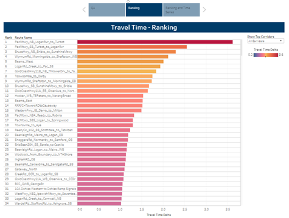
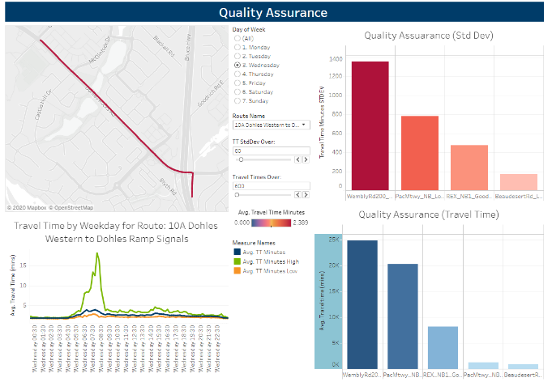
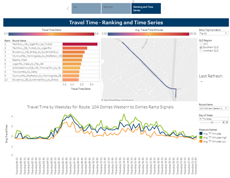
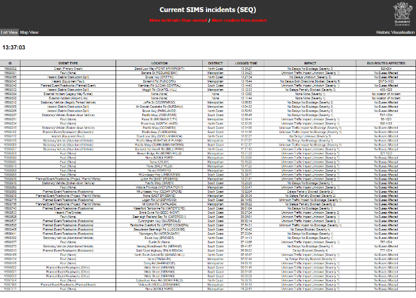
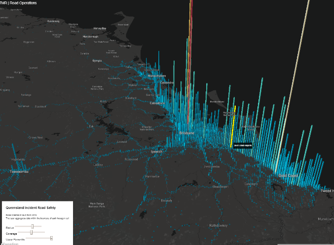
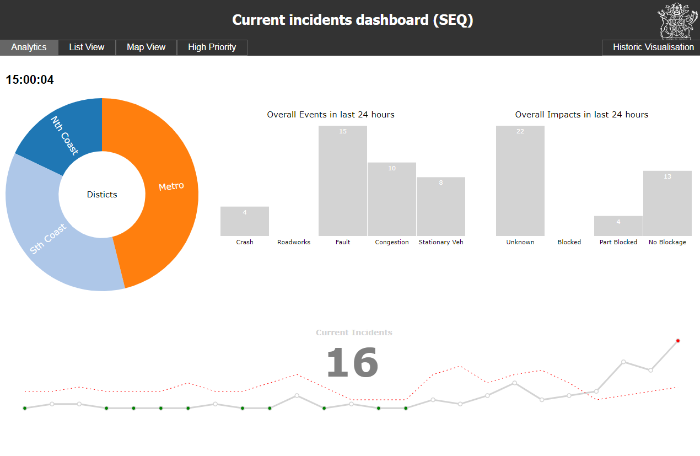
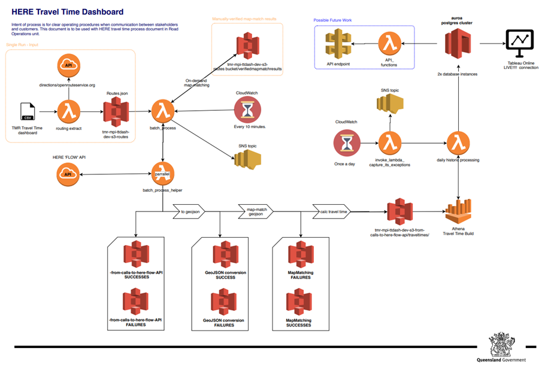

# Real Time Incident reporting tool
Real time incident reporting and passenger transport impacts application for traffic operators
to decrease their assessment and response time. Manage deployment on AWS platform including
flexible client engine & API integration. (Python, HTML5/JS, React/D3/Deck.gl, Postgres) 


The real-time road traffic monitoring system that incorporates probe data,traffic sensors and crowd sourced incident data to effectively analyse and report road network
abnormalities, supporting improved decision making, described by [Worrall, J (2020)](docs/worrall_2020_ITS_AsiaPacific.pdf) as follows.


Road incident and traffic monitoring in low latency environment for intelligent decision interfaces shown below.
<div class="box" align="center">
        
        
        <p style="text-align:center">
        <small>Figure 1. Route ranking (left), Quality assurances metrics (right)</small>
        </p>
  </div>


<p align="center">
</p><p style="text-align:center">
<small>Figure 2. Travel time ranking metrics</small>
</p>

<p></p>
<p style="text-align:left">
<i>Inferring Incidents impacts on passenger transport</i></p><p style="text-align:left">
Given the live feeds of bus and their schedule routes, we investigate the probability of affected
passenger transport services based on the condition of an incident, shown be below (figure 3,
left). The incident and bus information are continuously monitored and updated as feed
changes.
</p>
<div class="box" align="center">
        
        
        <p style="text-align:center">
        <small>Figure 3. Incidents and possible PT effect (left), visual data analysis exploratory tool (right)</small>
        </p>
  </div>


<p style="text-align:left">
<i>Inferring Incidents impacts on passenger transport</i></p><p style="text-align:left">
With afocus of proofing the concept and ability of integrating built systems within a TMR ecosystem
and providing lessons learnt. Below figure 4, shows the platform of event integration.
Road incident and traffic monitoring in low latency environment for intelligent decision making
</p>
<p align="center">
</p><p style="text-align:center">
<small>Figure 4. Real-time incidents performance metrics</small>
</p>


## Dependencies
- Python 2.7 (AWS lambda + Jupyter Notebook)
- Javascript (libraries deck.gl/D3/plotly and React)
- Postgres (AWS RDS)
- cloudwatch (AWS)

### Repo structure
```bash
├── README.md          # The top-level README for developers.
├── conf               # Space for credentials
│
├── data
│   ├── raw          # Immutable input data
│   ├── curated      # Data used to develop models
│   ├── models       # trained models
│   ├── model_output # model output
│   └── reporting    # Reports and input to frontend
│
├── docs                # Space for Sphinx documentation
│
│
├── images	        # All the images for site	
│
│
├── scripts 	        # contain all the JavaScript code used to 
│			            # add interactive functionality to your site
│
├── styles 	       # contain the CSS code used to style your content
│			  
│
├── notebooks           # Jupyter notebooks. Naming convention is
│                       # date YYYYMMDD (for ordering),
│                       # the creator's initials, and a short `-` 
│                       # delimited description.
│
├── references          # Data dictionaries, manuals, etc. 
│
├── results             # Final analysis and presentaitons.
│
├── requirements.txt    # The requirements file for reproducing the 
│                       # analysis environment.
│
├── .gitignore          # Avoids uploading data, credentials, 
│                       # outputs, system files etc
│
│
└── src                 # python Source code for use in this project. Makes src a Python module
    ├── __init__.py     
    │
    ├── utils       # Functions used across the projecta e.g lambda layers
    │   └── remove_accents.py
    │
    ├── data        # Scripts to reading and writing data etc
    │   └── load_data.py
    │
    ├── curated      # Scripts to transform data from raw to curated
    |   |             
    │   └── curated_data.py
    │
    ├── processing   # Scripts to turn curated data into modelling input
    |   |            
    │   └── process_modelling.py
    │
    ├── modelling   # Scripts to train models and then use trained models to make predictions. 
    |   |           
    │   └── train_model.py
    │
    ├── model_evaluation   # Scripts that analyse model performance and model selection. 
    |   |                  
    │   └── calculate_performance_metrics.py
    │
    ├── misc    # Scripts that qa and qc 
    |   |                     
    │   └── dates_days.py
    │           
    ├── reporting   # Scripts to produce reporting tables
    │   └── create_rpt_payment_summary.py
    │
    └── visualisation    #  Scripts to create frequently used plots
        └── visualise_patient_journey.py
```


<p style="text-align:left">
<i>Real-time processing and storage</i></p><p style="text-align:left">
For this application we utilised cloud computing (AWS), particularly the services lambda, S3,
glue, Athena, RDS.
</p>
<p align="center">
</p><p style="text-align:center">
<small>Figure 4. Real-time incidents performance metrics</small></p>
